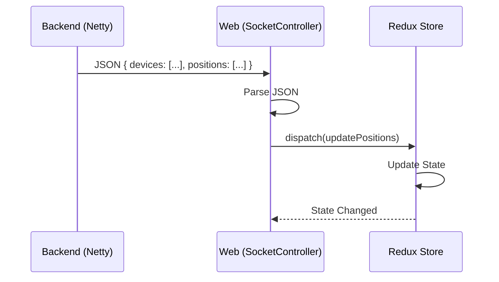

# Integration Guide: Frontend & Backend Communication

This document explains how the Fleet web interface interacts with the Fleet backend.

## 1. REST API Interaction

The frontend uses standard HTTP requests to interact with the backend resources.

- **Base URL**: `/api/` (proxied to the backend port, usually 8082).
- **Authentication**: Uses JSESSIONID cookie after a successful login via `/api/session`.
- **Primary Endpoints**:
    - `GET /api/session`: Retrieves current user session and server configuration.
    - `GET /api/devices`: Lists all devices accessible to the user.
    - `GET /api/positions`: Retrieves the latest positions for all devices.
    - `POST /api/commands/send`: Sends a command to a specific device.

### Handling API Calls
The frontend uses a utility function `fetchOrThrow` (`src/common/util/fetchOrThrow.js`) which handles basic error checking and throws an error if the response is not OK.

## 2. WebSocket Real-time Flow

For real-time updates (live tracking), the frontend establishes a WebSocket connection.

- **Endpoint**: `ws://[hostname]/api/socket` (or `wss://` for secure connections).
- **Controller**: `SocketController.jsx` manages the lifecycle of this connection.

### WebSocket Data Structure
The backend sends JSON objects containing one or more of the following keys:



- `devices`: Updates to device status or metadata.
- `positions`: New or updated GPS coordinates.
- `events`: System events (geofence entry/exit, alarms, etc.).
- `logs`: Backend logs (if enabled).

### Logic Flow
1. **Connection**: Once authenticated, the frontend opens the WebSocket.
2. **Message Reception**: `SocketController` parses the JSON and dispatches Redux actions (`devicesActions.update`, `sessionActions.updatePositions`).
3. **State Sync**: The Redux store updates, triggering a re-render of the map and device list.
4. **Reconnection**: If the socket closes unexpectedly, the controller attempts to periodically reconnect.

## 3. Development Proxy

During development, Vite handles the redirection of API and WebSocket calls to the backend. This is configured in `vite.config.js`:

```javascript
server: {
  proxy: {
    '/api/socket': {
      target: 'ws://localhost:8082',
      ws: true,
    },
    '/api': 'http://localhost:8082',
  },
},
```
