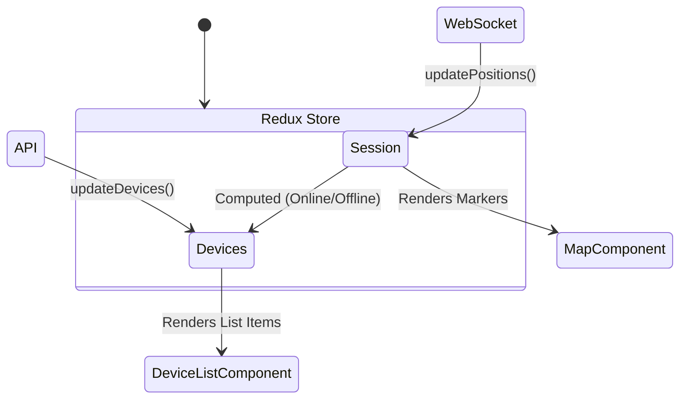

# State Management Guide

Fleet Web uses **Redux Toolkit** to manage the global application state. This ensures that changes (like a device moving) are instantly reflected across different components (Map, Device List, Reports).

## Core Slices

The store is composed of several "slices", each responsible for a specific domain of data. All slices are located in `src/store/`.

### 1. Session Slice (`session.js`)
This is the central slice for the current user's context.
- **state.server**: Server-wide configuration (obtained from `/api/server`).
- **state.user**: The currently logged-in user profile.
- **state.socket**: Status of the WebSocket connection.
- **state.positions**: A map of `{ deviceId: Position }` representing the *latest* known location of every device.
- **state.history**: Temporary storage for breadcrumb trails (if enabled).

### 2. Devices Slice (`devices.js`)
- Contains the list of all devices the user has access to.
- Handles CRUD operations (adding, removing, editing devices).
- **computed properties**: Derived state like "online/offline" is often calculated in components or selectors based on data here and in `session.positions`.

### 3. Geofences Slice (`geofences.js`)
- Stores geofence definitions (circles, polygons).
- Used by the map to draw zones and by the reports to show activity.

### 4. Events Slice (`events.js`)
- A log of recent notifications and alerts received via WebSocket.
- Used to display the "toast" notifications and the events drawer.

## Data Flow

1.  **Initialization**: `App.jsx` dispatches `fetchServer` and `fetchUser` on load.
2.  **Live Updates**:
    - `SocketController.jsx` listens for WebSocket messages.
    - When a `position` update arrives, it dispatches `sessionActions.updatePositions(positions)`.
    - The `MainMap` component subscribes to `state.session.positions` and moves the markers.
3.  **User Actions**:
    - When a user sends a command, `devicesActions` might be dispatched to update the UI optimistically, or the app waits for the API response.

## Selectors

We use memoized selectors (via `createSelector`) to prevent unnecessary re-renders.
- **Example**: A selector might filter the list of devices to only show those that are "online" and "moving".
